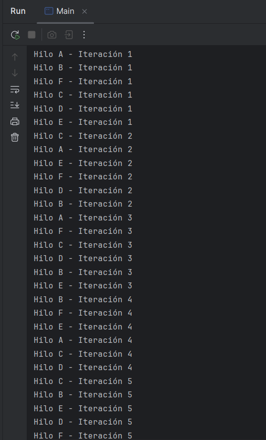
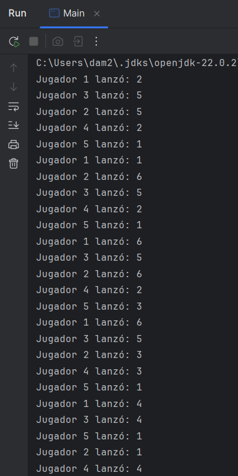
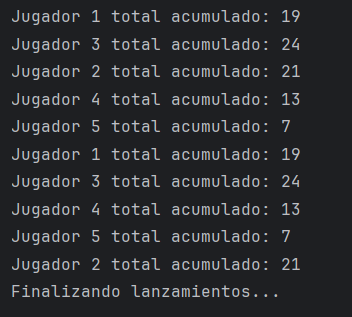

# UT1 Parte1 Evaluación

## Ejercicio 1: Hilos con Nombres Personalizados

En este ejercicio vemos como realizamos las distintas iteraciones intercaladas, cuando llega a 5 termina. He añadido tres hilos más para probar.

## Ejercicio 2: Simulacion de un juego de Dados con executors

En este ejercicio hacemos lanzamientos y acumulamos la cantidad de lanzamientos para mostrarlo en el total.

